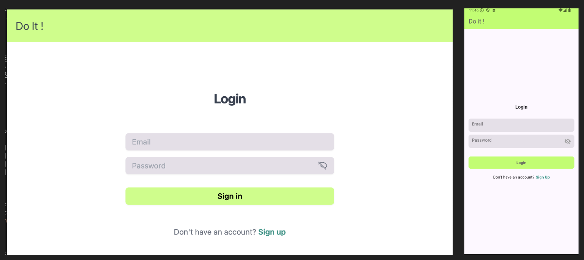
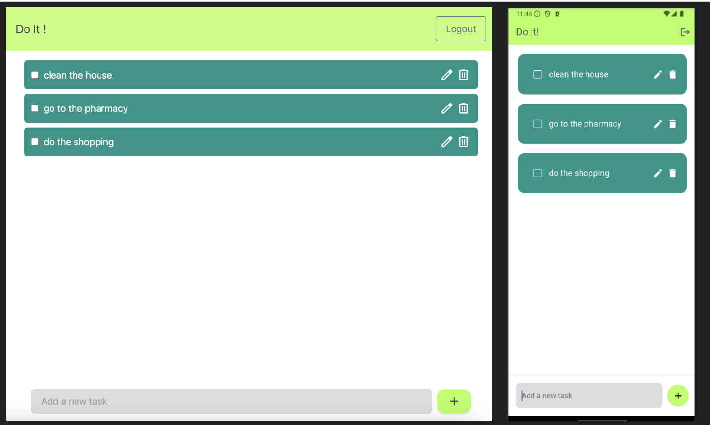

# Projet Angular Flutter Cloud

Ce projet est une application de gestion de tâches développée en utilisant Angular pour le web et Flutter pour le mobile.

## Structure du projet

- [Mobile](mobile/README.md) - Application mobile développée avec Flutter.
- [ToDo Web](to_do_web/README.md) - Application web développée avec Angular.

## Démarrage

### Comptes de test

Pour tester l'application, vous pouvez utiliser les comptes suivants :
| Nom d'utilisateur    | Mot de passe |
|----------------------|--------------|
| test@test.com        | tester       |
| flamby@flamby.fr     | flamby       |

### Application Mobile

Pour démarrer l'application mobile, suivez les instructions dans le fichier [README.md](mobile/README.md) du dossier `mobile`.

### Application Web

Pour démarrer l'application web, suivez les instructions dans le fichier [README.md](to_do_web/README.md) du dossier `to_do_web`.

## Contributeurs

- Robin Malpart
- Sara Bevilacqua
- Julien Chazal

## Aperçu de l'application

